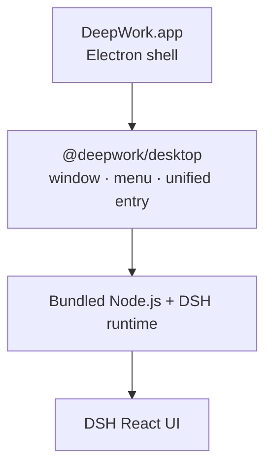

# DeepWork

[简体中文](./README.md)

<p align="center">
  
</p>

**DeepWork** is an installable, extensible desktop workbench powered by
[DeepSeek Harness](https://github.com/deepseek-ai/deepseek-harness) (DSH).

> [!IMPORTANT]
> **Community-maintained, unofficial third-party project.** This project is
> not an official DeepSeek product; it is not developed, published, endorsed,
> or supported by DeepSeek. `DeepSeek`, `DeepSeek Harness`, `dsh` and related
> names, logos and trademarks belong to their respective owners. Please file
> issues for the desktop client here, not with DeepSeek support.

DeepWork keeps DSH's React UI and packages a pinned DSH runtime, Node.js,
Electron and local capabilities into one desktop application. Models still run
in the cloud; the desktop side owns the terminal, Workspace, Git, Browser,
window integration and plugin lifecycle.

It is not another DSH frontend, and it does not require a separate Web
Terminal or shell plugin. `@deepwork/desktop` provides the unified desktop
entry; feature modules keep using DSH's official Profile, Loader, locale,
settings and ThemeService contracts.

## Highlights

- Self-contained Apple Silicon macOS app + installer, and Windows x64 NSIS
  installer / portable zip.
- Multi-tab PTY terminal, per-commit/per-line Review, Browser and Files.
- Review comments can be aggregated into the message composer for the Agent.
- Pinned Summary, expandable Side Panel and native window controls.
- **Plugins** and **Settings** entries at the bottom of the desktop sidebar:
  the plugin marketplace supports isolated preview, discard, apply and
  restore; settings reuse the DSH settings page with desktop skins.
- Real-time Chinese/English switching and four DeepWork desktop skins.
- Human UI and Agent share the same plugin-install transaction and approval
  boundary.

## Install

### Test packages

Download the test package from [GitHub Releases](https://github.com/oli-bot/dsh-desktop/releases):

- `DeepWork-0.1.2-arm64.dmg`
- `DeepWork-0.1.2-arm64.zip`

Open the DMG and drag `DeepWork.app` into `Applications`. Current test
packages have no Developer ID or notarization; on first launch, right-click
the app in Finder and choose "Open".

Linux x64 can be built from source; the first AppImage / deb is not released
yet. The desktop app shares `$DSH_HOME` (default `~/.dsh`) with the native
DeepSeek Harness; the DeepSeek API key can be configured in the DSH settings
page or written to `.env` in that directory.

### From source

Requires Node.js 24+ and pnpm:

```sh
pnpm install
pnpm run build
pnpm run stage:dsh
pnpm start
```

`start` builds the desktop artifacts, stages the DSH runtime, then launches
Electron. First build puts the source into `.cache/dsh-source/`. To use
another checkout, set `DSH_SOURCE=/absolute/path` (package version must match
the pinned version).

## Shared DeepSeek Harness config and sessions

The desktop app and the native DeepSeek Harness share the same `DSH_HOME`
(default `~/.dsh`, overridable with `DSH_HOME`), so **model configuration,
API keys and session history are all shared** — no double configuration:

```text
macOS   ~/.dsh            (or $DSH_HOME)
Windows %USERPROFILE%\.dsh (or %DSH_HOME%)
```

The desktop app's own state (logs, plugin-marketplace previews) stays in
Electron's userData (macOS `~/Library/Application Support/DeepWork`).

## Architecture



- `@deepwork/desktop` (`src/main.ts`) is the single desktop entry: creates the
  window and menus, manages the DSH runtime lifecycle, provides the Electron
  bridge, and registers the built-in plugin loading order.
- The DSH Host starts the Web runtime on a random loopback port; desktop
  client plugins are injected on the browser side via `cordis.patch.yml`.
- Third-party plugins are still managed by the DSH Profile and Loader.

### Runtime directories

- `.stage/dsh-runtime`: staged DSH runtime (generated by `stage:dsh`).
- `.stage/node-runtime`: staged Node.js runtime.
- `.cache/`: DSH source and Node.js download caches.
- `dist/`: compiled desktop and plugin artifacts.

## Local build and release

```sh
# macOS (full build + quick build)
pnpm run dist:mac
pnpm run dist:mac:quick

# Windows (run on a Windows machine or in CI)
pnpm run dist:win
pnpm run dist:win:quick

# Both platforms in sequence
pnpm run dist:all
```

Artifacts land in `release/`:

```text
release/
├── DeepWork-0.1.2-arm64.dmg     (macOS)
├── DeepWork-0.1.2-arm64.zip     (macOS)
├── DeepWork-0.1.2-x64-setup.exe (Windows NSIS)
└── DeepWork-0.1.2-x64.zip       (Windows portable)
```

The bundled Node runtime matches the build machine by default; for
cross-platform packaging set `DEEPWORK_NODE_PLATFORM` (`linux`/`darwin`) and
`DEEPWORK_NODE_ARCH` (`x64`/`arm64`), e.g. `pnpm run dist:mac:x64`.

A GitHub Actions workflow (`.github/workflows/release.yml`) builds both
platforms on tags. Verify locally before uploading:

```sh
pnpm run typecheck
pnpm test
pnpm run dist:mac:quick
codesign --verify --deep --strict release/mac-arm64/DeepWork.app
hdiutil verify release/DeepWork-0.1.2-arm64.dmg
```

Current package, download notes and public Release are `v0.1.2`. To prepare
the next version, update the workspace package version first, then create a
tag and Release with the same version.

## License

[BSD 3-Clause](./LICENSE)