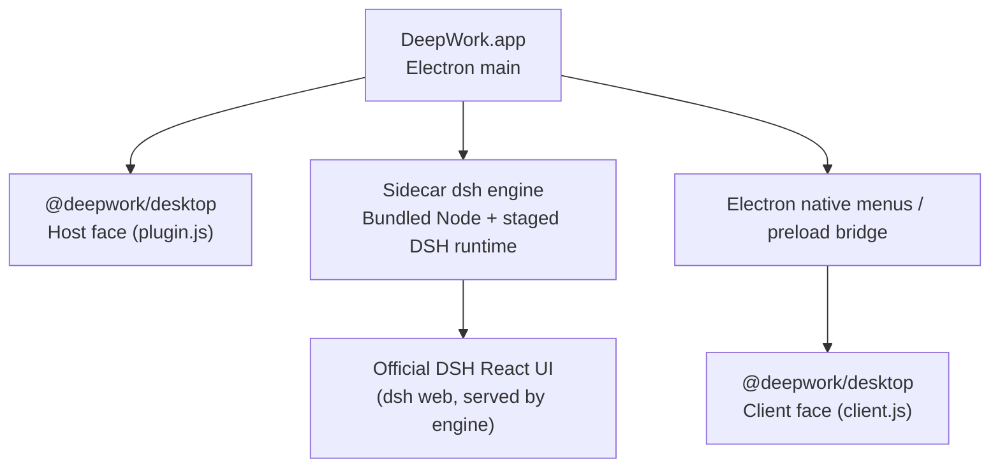

<p align="center">
  <a href="./README.md">简体中文</a> ·
  <strong>English</strong>
</p>

<div align="center">
  
  <h1>DeepWork</h1>
  <p><strong>A desktop shell powered by DeepSeek Harness (Electron + sidecar dsh + stock DSH web UI).</strong></p>
  <p>
    <a href="#architecture">Architecture</a> ·
    <a href="#desktop-native-capabilities">Native capabilities</a> ·
    <a href="#platforms-and-artifacts">Platforms</a> ·
    <a href="#build-and-release">Build &amp; release</a>
  </p>
</div>

<p align="center">
  
  
  
  
  
  
</p>

DeepWork is a desktop application around
[DeepSeek Harness](https://github.com/deepseek-ai/deepseek-harness) (DSH): an
Electron shell acts as the host, spawns a **stock `dsh` engine** as a sidecar,
and loads the engine's web runtime — the official DSH React UI — into
Chromium. Models still run in the cloud; the desktop side owns the window,
menus, engine lifecycle and local integration.

It is not another DSH frontend, and it does not require a separate Web
Terminal or shell plugin: the UI is the stock `dsh web` surface, and desktop
capabilities are injected into the same engine as a plugin.

> [!IMPORTANT]
> **Community-maintained, unofficial third-party project.** This project is
> not an official DeepSeek product; it is not developed, published, endorsed
> or supported by DeepSeek. `DeepSeek`, `DeepSeek Harness`, `dsh` and related
> names, logos and trademarks belong to their respective owners. Please file
> issues for the desktop client here, not with DeepSeek support.

## Architecture



- `src/main.ts` (Electron main): window, native menus, splash, full sidecar-engine
  lifecycle supervision, and the bridge between native actions and the renderer.
- `src/runtime.ts` (`SidecarSupervisor`): spawns the engine with a **real Node**
  (staged node-runtime): `<node> <dsh CLI> --profile web --patch <cordis.patch.yml>`,
  waits for the `dsh web: http://127.0.0.1:<port>` readiness line, then points
  Chromium at that URL. Teardown escalates SIGTERM → SIGKILL after a timeout.
- `src/profile.ts` (`ensureProfile`): boots the shared `$DSH_HOME/profiles/web`
  profile, preserving existing bundles / dependencies / user patches and adding
  only `@deepwork/desktop` as a `link:` dependency; the desktop patch layer is
  passed via `--patch` — **the browser and the desktop share one profile**.
- `src/plugin.ts` (Host face, `dist/plugin.js`): publishes desktop facts into the
  DSH Host graph (`provide('desktop', …)`), injects a system-prompt section that
  identifies the DeepWork surface, and registers `DEEPWORK_*` bash env vars.
- `src/client.ts` (Client face, `dist/client.js`): a thin command bridge that
  forwards native menu actions to DSH's `sessions` / `workspaces` / `layout`
  services (requires the Electron preload bridge `window.dshDesktop`).
- `src/preload.ts` / `src/contracts.ts`: the minimal `contextBridge` bridge and
  its type contracts.
- `cordis.patch.yml`: the boot patch layer — pins the webserver to a random
  `127.0.0.1` port and `insert`s the `deepwork` plugin row.

### Shared `$DSH_HOME` with the CLI / browser

The engine inherits the shell's `DSH_HOME` (default `~/.dsh`, overridable via
the environment), so models, credentials, sessions and attachments are shared
with the CLI and the browser GUI. The desktop mounts the very same `web`
profile, producing no second set of state. Desktop-owned state (logs) lives in
the Electron userData.

### Runtime directories

| Path | Content | Tracked |
| --- | --- | --- |
| `stage/dsh-runtime` · `stage/node-runtime` | DSH / Node runtimes produced by `stage:dsh` | gitignored |
| `.cache/` | DSH source clone and Node download cache | gitignored |
| `dist/` | compiled desktop / plugin artifacts from `build` | gitignored |
| `release/` | electron-builder output | gitignored |
| `src/` | shell and plugin source | tracked |

## Desktop native capabilities

This version is a lean shell that keeps the stock DSH UI:

- **Window & lifecycle**: splash (startup / error / restart, with log tail),
  single-instance lock, macOS mock keychain (`--use-mock-keychain`), engine
  shut down on window close.
- **Native menu (macOS)**: About / Settings… / Restart Engine / Services /
  Hide / Quit; **File**: New Session, Open Workspace…, Close; **Edit** /
  **View** / **Window** are standard roles.
- **Shortcuts** (actually wired):
  | Action | Shortcut |
  | --- | --- |
  | New session | `Cmd/Ctrl+N` |
  | Open workspace… | `Cmd/Ctrl+O` |
  | Toggle sidebar | `Cmd/Ctrl+B` |
  | Settings… | `Cmd/Ctrl+,` |
  | Restart engine | `Cmd/Ctrl+Shift+R` |
- **Command bridge**: menu actions go through the preload → `client.ts` → DSH
  services (new session / open workspace paths / open settings / toggle
  sidebar / focus composer).
- **Hardening**: window uses `sandbox + contextIsolation`, webviews only allow
  `http(s)` and have their preload stripped; the engine listens only on a
  random loopback port; `clipboard-sanitized-write` is gated to the runtime
  origin.

> Note: this version intentionally does **not** include a PTY terminal panel,
> per-commit/per-line Review, Browser / Files panels, plugin marketplace, desktop
> skins, or Pinned Summary — those earlier-iteration features live in a
> separate DeepWork web-surface repository. This repo maintains only the
> "shell + stock UI" form.

## Platforms and artifacts

Four platform installers are published under the same Git-tag GitHub Release:

| Platform | Artifact (current v0.1.2) | Command |
|------|------|----------|
| macOS arm64 | `DeepWork-0.1.2-mac-arm64.dmg` / `.zip` | `pnpm run dist:mac` |
| macOS x64 | `DeepWork-0.1.2-mac-x64.dmg` / `.zip` | `pnpm run dist:mac:x64` |
| Windows x64 | `DeepWork-0.1.2-win-x64.exe` (NSIS) | `pnpm run dist:win` |
| Windows arm64 | `DeepWork-0.1.2-win-arm64.exe` (NSIS) | `pnpm run dist:win:arm64` |

Packaging bundles the target platform's Node runtime (`node.exe` on Windows,
`bin/node` on macOS) and its native modules: when the target platform differs
from the host, `stage-dsh.mjs` writes a `supportedArchitectures` block (os/cpu =
`current` + target) into `pnpm-workspace.yaml` so the deploy phases pulls the
target's native deps (`@koromix/koffi-*`, `node-addon-require-builtin`,
`node-pty` prebuilds, …). Cross-built Windows / x64 bundles therefore carry the
correct native modules. When cross-packaging Windows on macOS, `build-win.mjs`
wraps the cached electron-builder `7za` with `-snl` (store symlinks as links,
don't follow) to avoid ENAMETOOLONG failures caused by recursive workspace
links in the staged runtime.

## From source

Prerequisites: Node.js 24+ and pnpm:

```sh
pnpm install
pnpm run build       # compile main/preload/plugin/client → dist/
pnpm run stage:dsh   # produce stage/dsh-runtime and stage/node-runtime
pnpm start
```

- The first `stage:dsh` clones and builds the pinned DSH (`0.1.0-rc.5`, commit
  `47f943859bef60e4160492346772ded9b24f765a`) into `.cache/dsh-source/`.
- To use a local DSH checkout as the backend engine, set
  `DSH_SOURCE=/path/to/deepseek-harness` (version must match the pinned one),
  then `pnpm run build:dsh` (full rebuild) and `pnpm run stage:dsh`.
- `pnpm run dist:mac:quick` reuses the cached DSH build for fast iteration.

## Install

Download the installer for your platform from
[GitHub Releases](https://github.com/oli-bot/dsh-desktop/releases)
(current v0.1.2):

- macOS arm64 / x64: `DeepWork-0.1.2-mac-arm64.dmg` (or `.zip`), etc.
- Windows x64 / arm64: `DeepWork-0.1.2-win-x64.exe`, etc.

On macOS, open the DMG and drag `DeepWork.app` into Applications; test packages
have no Developer ID or notarization, so on first launch right-click the app
and choose "Open". On Windows, run the NSIS installer (not one-click; you can
choose the install directory). The app shares `$DSH_HOME` with native DSH —
configure models and the API key in the DSH settings page (credentials are
persisted by DSH under the shared home).

## Build and release

```sh
# macOS arm64: full build (rebuild pinned DSH) / quick (skip DSH rebuild)
pnpm run dist:mac
pnpm run dist:mac:quick

# macOS x64 (cross-build on an arm64 machine)
pnpm run dist:mac:x64

# Windows x64 / arm64 (Windows machine, or cross-build on macOS)
pnpm run dist:win
pnpm run dist:win:quick
pnpm run dist:win:arm64

# All four platforms in sequence
pnpm run dist:all
```

Artifacts land in `release/`: `DeepWork-<version>-mac-arm64.dmg/.zip`,
`mac-x64.dmg/.zip`, `win-x64.exe`, `win-arm64.exe`, plus
`latest-mac.yml` / `latest.yml` (auto-update metadata) and unpacked dirs
(`mac-arm64` / `mac` / `win-unpacked` / `win-arm64-unpacked`).

GitHub Actions (`.github/workflows/release.yml`, triggered on `v*` tags) runs a
full build on `macos-latest` and uploads the macOS arm64 artifacts to that
tag's Release. Windows / x64 artifacts are produced by macOS cross-build
(`pnpm run dist:win:*`, `dist:mac:x64`) or on a Windows machine and uploaded to
the same Release (native windows-latest CI is blocked by junction-tree staging;
see the workflow comments). Verify locally before shipping:

```sh
pnpm run typecheck
pnpm test
pnpm run dist:mac:quick
codesign --verify --deep --strict release/mac-arm64/DeepWork.app
hdiutil verify release/DeepWork-0.1.2-mac-arm64.dmg
```

To prepare a new version: bump `version` in `package.json`, then create a tag
and Release with the same version (`gh release create vNEXT <artifacts...>`) and
attach the artifacts.

## Security boundary

- The engine listens only on a random `127.0.0.1` port; agent channels are not
  exposed.
- The window uses `sandbox + contextIsolation` with no `nodeIntegration`;
  webviews only allow `http(s)` sources and have their preload stripped.
- The desktop patch layer is injected into the engine via `--patch`, never
  written into the user profile's `cordis.patch.yml`; `ensureProfile` only adds
  the single `@deepwork/desktop` `link:` dependency and overrides no user
  bundles, dependencies or patches.
- The engine process is supervised and torn down cleanly; the single-instance
  lock prevents duplicate shells.

## License

[MIT](./LICENSE)
