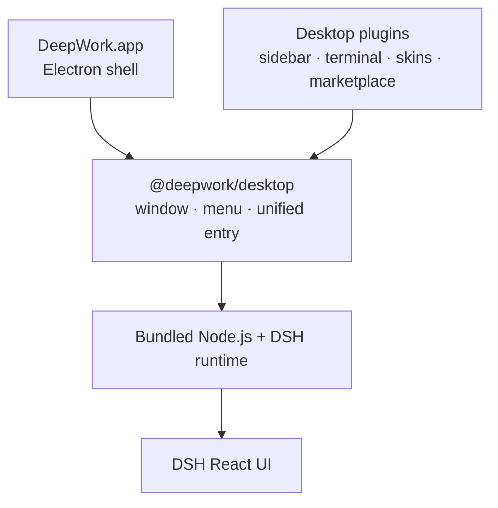

<p align="center">
  <strong>简体中文</strong> ·
  <a href="./README.en.md">English</a>
</p>

<div align="center">
  
  <h1>DeepWork</h1>
  <p><strong>以 DeepSeek Harness 为引擎的可安装、可扩展桌面工作台。</strong></p>
  <p>
    <a href="#安装">安装</a> ·
    <a href="#架构">架构</a> ·
    <a href="#内置-plugins">内置 Plugins</a> ·
    <a href="#本地构建与发布">构建与发布</a>
  </p>
</div>

<p align="center">
  
  
  
  
  
  
</p>

DeepWork 保留 DeepSeek Harness（DSH）的 React UI，把固定版本的 DSH
runtime、Node.js、Electron 和本地能力打包进一个桌面应用。模型仍运行在
云端，桌面端负责终端、Workspace、Git、浏览器、窗口集成和 plugin 生命周期。

它不是另一套 DSH 前端，也不需要额外安装 Web Terminal 或 shell plugin。
`@deepwork/desktop` 提供统一桌面入口，功能模块继续沿用 DSH 官方的
Profile、Loader、locale、settings 和 ThemeService 契约。

> [!IMPORTANT]
> **社区维护的非官方第三方项目。** 本项目并非 DeepSeek 官方产品，
> 不由 DeepSeek 开发、发布、背书或提供支持。`DeepSeek`、`DeepSeek
> Harness`、`dsh` 及相关名称、标识和商标归其各自权利人所有。桌面端的问题
> 请提交到本仓库，不要联系 DeepSeek 官方支持。

## 主要能力

- 自包含的 Apple Silicon macOS 应用与安装包，以及 Windows x64 安装器（NSIS）/ 便携版 zip。
- 多标签 PTY Terminal、逐提交/逐行 Review、Browser 和 Files。
- Review 评论可汇总进消息输入框，直接交给 Agent 处理。
- Pinned Summary、可展开 Side Panel 与原生窗口控制。
- 桌面左下角的 **插件（Plugins）** 与 **设置（Settings）** 入口：插件市场
  支持隔离预览、放弃、应用和恢复；设置沿用 DSH 设置页并支持桌面皮肤。
- 中英文实时切换，以及四套 DeepWork 自有桌面皮肤。
- 人类 UI 与 Agent 共用同一套插件安装事务和审批边界。

## 界面预览

**左下角入口**：桌面左侧栏底部提供 **插件** 与 **设置** 两个选项，点击
“插件”打开插件市场，“设置”打开 DSH 设置页。

**插件市场**：浏览公共 DSH 社区目录，并在隔离环境中预览变更。

**桌面皮肤**：在 DSH 设置页即时切换，由 Host 持久化选择。

## 使用本地 DeepSeek Harness 作为后端引擎

默认构建使用固定版本 DSH `0.1.0-rc.5`（官方公开仓库
`47f943859bef60e4160492346772ded9b24f765a`）。如果你有一个本地
DeepSeek Harness checkout，可以通过 `DSH_SOURCE` 让它成为本应用打包进
安装包的后端引擎（版本必须与固定版本一致）：

```sh
# 例：把本仓库旁边的本地 DSH checkout 打进安装包
DSH_SOURCE=/path/to/deepseek-harness pnpm run build:dsh
DSH_SOURCE=/path/to/deepseek-harness pnpm run stage:dsh
DSH_SOURCE=/path/to/deepseek-harness pnpm run dist:mac:quick
```

安装后应用就是 DeepSeek Harness 界面 + 该 DSH 运行时（同一份代码作为后端引擎）。

## Windows 支持

macOS 之外，本仓库也提供 Windows x64 安装包构建：

```sh
DSH_SOURCE=/path/to/deepseek-harness pnpm run dist:win:quick
# 产物：
#   release/DeepWork-0.1.1-x64-setup.exe  (NSIS 安装器，建议在 Windows 上构建)
#   release/DeepWork-0.1.1-x64.zip        (便携版，跨平台可直接打包)
```

Windows 构建会在 stage 阶段下载并打包 Windows 版 Node.js 运行时
（`node.exe` + `pnpm.cmd`），并把 `node-pty` 的 win32-x64/arm64
ConPTY 预编译产物一起打进包。为得到完整可用的 Windows 原生依赖
（koffi / sharp 等平台包），请在 Windows 机器上执行上述命令，或使用
仓库自带的 GitHub Actions 工作流
（`.github/workflows/release.yml`，macOS + Windows 双平台产物）。

> 说明：macOS 上交叉打包 Windows 目标时，electron-builder 自带的 7za 会
> 跟随 staged 运行时的 pnpm workspace 符号链接形成递归路径并刷屏
> ENAMETOOLONG 警告，导致构建失败；`build-win.mjs` 会自动把缓存的
> 7za 包装为 `-snl`（符号链接按链接存储，不跟随）以解决此问题。
> 因此 macOS 上也能直接产出 `x64-setup.exe` 与 `x64.zip`。
> 若需完整的 Windows 原生依赖（koffi / sharp 等平台包），仍建议在
> Windows 机器或 CI（`.github/workflows/release.yml`）上构建。

## 安装

### 安装测试包

从 [GitHub Releases](#releases)
下载测试包（本仓库的发布名称为 DeepWork）：

- `DeepWork-0.1.1-arm64.dmg`
- `DeepWork-0.1.1-arm64.zip`

打开 DMG，把 `DeepWork.app` 拖入 `Applications`。当前测试包没有
Developer ID 和 notarization，首次启动时可在 Finder 中右键应用并选择
“打开”。

Linux x64 已支持从源码构建；首个 AppImage / deb 尚未发布。发布后会出现在
GitHub Releases。桌面应用与原生 DeepSeek Harness 共享 `$DSH_HOME`
（默认 `~/.dsh`），DeepSeek API key 可以在 DSH 设置页配置，也可以写入
该目录下的 `.env`。

### 从源码运行

需要 Node.js 24+ 与 pnpm：

```sh
pnpm install
pnpm run build
pnpm run stage:dsh
pnpm start
```

`start` 会先构建 desktop 产物，再 stage DSH runtime，最后启动 Electron。
首次构建会把源码放进 `.cache/dsh-source/`。如需使用另一个 checkout，可设置
`DSH_SOURCE=/absolute/path`，但 package version 必须与固定版本一致。

## 共享 DeepSeek Harness 配置与会话

桌面应用与原生 DeepSeek Harness 共用同一套 `DSH_HOME`（默认
`~/.dsh`，macOS 与 Windows 相同；可用环境变量 `DSH_HOME` 覆盖），
因此**模型配置、API Key、会话历史全部共享**，不需要配两次：

```text
macOS   ~/.dsh            （或 $DSH_HOME）
Windows %USERPROFILE%\.dsh （或 %DSH_HOME%）
Linux   ~/.dsh            （或 $DSH_HOME）
```

DeepSeek API key 可以在 DSH 设置页配置，也可以写入该目录下的 `.env`。
桌面应用自己的状态（日志、插件市场预览等）仍在 Electron 的 userData
（macOS `~/Library/Application Support/DeepWork`）。

## 常用操作

| 操作 | 快捷键 |
| --- | --- |
| 新建会话 | `Cmd/Ctrl+N` |
| 打开工作区 | `Cmd/Ctrl+O` |
| 切换侧栏 | `Cmd/Ctrl+B` |
| 切换底部面板 | `Cmd/Ctrl+J` |
| 切换工具侧栏 | `Alt+Cmd/Ctrl+B` |
| 打开浏览器 | `Cmd/Ctrl+T` |
| 打开文件 | `Cmd/Ctrl+P` |
| 打开 Review | `Ctrl+Shift+G` |
| 侧边会话 | `Alt+Cmd/Ctrl+S` |
| 聚焦输入框 | `Cmd/Ctrl+L` |
| 重新启动 DSH Runtime | `Cmd/Ctrl+Shift+R` |

工具侧栏与底部面板都可以通过顶部菜单栏或对应快捷键开关。

## 架构



- `@deepwork/desktop`（`src/main.ts`）作为唯一桌面入口：创建窗口、菜单、
  管理 DSH runtime 生命周期、提供 Electron bridge，并注册内置 plugin 的
  加载顺序。
- DSH Host 在随机 loopback 端口启动 Web runtime；桌面 client plugins 通过
  `cordis.patch.yml` 注入浏览器侧图。
- Better Sidebar Host（`@deepwork/better-sidebar-runtime`）复用
  `upstream/DSH-better-sidebar` submodule 的 Host 能力（PTY、Files、Git、
  history、commit diff），桌面 UI 由 `@deepwork/*` 插件提供。
- 第三方插件仍由 DSH Profile 和 Loader 管理。

### 运行时目录

- `.stage/dsh-runtime`：staged DSH runtime（由 `stage:dsh` 生成）。
- `.stage/node-runtime`：staged Node.js runtime。
- `.cache/`：DSH 源码与 Node.js 下载缓存。
- `dist/`：desktop 与 plugins 的编译产物。

## 内置 plugins

| Plugin | 来源关系 | DeepWork 改造 |
| --- | --- | --- |
| `@deepwork/desktop` | DeepWork 自研 | 统一桌面入口、Electron bridge、原生菜单、窗口、Agent 能力与内置 plugin 注册顺序 |
| `@deepwork/better-sidebar-runtime` | 固定跟踪 [`DSH-better-sidebar`](https://github.com/omdsh-dev/DSH-better-sidebar) submodule | 仅编译上游 Host，提供 PTY、Files、Git、history 和 commit diff；不加载上游 UI |
| `@deepwork/panel-controls` | 对早期 dsh-web-panel 交互模型的下游重实现 | 保留 DeepWork Terminal dock、主题、双语和 Session 状态，复用统一 PTY Host；不再安装独立 Web Terminal |
| `@deepwork/pinned-summary` | DeepWork 自研 | 当前 Session 摘要、半高卡片和正文 gutter 管理 |
| `@deepwork/desktop-sidebar` | [`DSH-better-sidebar`](https://github.com/omdsh-dev/DSH-better-sidebar) 的 DeepWork UI 下游 | 复用统一 Host，提供 Session tabs、viewer、Files、Git Review、逐行评论和 Agent composer 引用，保留现有布局、图标与主题 |
| `@deepwork/plugin-marketplace` | 兼容 [`plugin-registry`](https://github.com/vlln/plugin-registry)、[`dsh-hub`](https://github.com/omdsh-dev/dsh-hub) 与公共 [`dsh-suite`](https://github.com/whyihaveyou/dsh-suite) 目录 | 统一隔离预览、风险确认、TOFU 来源锁、应用与恢复流程，并适配桌面导航和双语 UI |
| `@deepwork/desktop-skins` | 对早期 dsh-skins ThemeService 扩展模型的下游重实现 | 沿用 ThemeService 扩展思路，重做皮肤、设置 UI 和 Host 持久化 |

标记为“下游改造”或“炼化”的 plugin 会定期检查上游 release 和 feature，选择
与当前 DSH 契约兼容的能力同步。同步以 feature 为单位重新适配，不直接覆盖
DeepWork 的 UI、主题和桌面交互。

更完整的来源与许可证说明见
[THIRD_PARTY_NOTICES.md](./THIRD_PARTY_NOTICES.md)。

## 插件市场

左侧底部 **插件（Plugins）** 页面默认读取公开的
`whyihaveyou/dsh-suite/data/plugins.json` 目录，并保留条目中的规范
`owner/repo` 身份。安装、更新、启用、停用和卸载都会先生成隔离 candidate
Profile：

```text
检查来源与精确 commit
        ↓
在隔离 Profile 中安装并启动预览
        ↓
放弃（当前桌面不变）或应用（保留 previous）
        ↓
需要时 Undo 恢复上一份 Profile
```

Agent 也可以通过对话进入同一流程。应用和恢复仍需要人类审批，不能绕过预览
或启动第二套 DSH Loader。私有仓库认证使用 GitHub CLI：

```sh
gh auth login
```

可通过 `DEEPWORK_MARKETPLACE_CATALOG=owner/repository/path/to/catalog.json`
切换到兼容的 `dsh-external-hub/v0.1`、`omdsh-registry/v1` 或
`dsh-suite` 1.0 目录。

## 安全边界

- DSH Web runtime 与 Agent 管理通道只监听随机 loopback 端口。
- Browser 使用独立 Electron partition，不注入 Node.js 或 preload。
- Better Sidebar Host 对 Files 和 Git 请求执行 Session 与 Workspace 边界校验。
- 市场固定 Git commit，默认阻止安装脚本，应用前不修改当前 Profile。
- pnpm release-age 策略保持启用，只排除 `@deepseek-ai/*`。

## 本地构建与发布

完整构建会重建固定 DSH；缓存已经就绪时可使用 quick 构建：

```sh
# macOS（完整构建 + quick 构建）
pnpm run dist:mac
pnpm run dist:mac:quick

# Windows（在 Windows 机器或 CI 上执行）
pnpm run dist:win
pnpm run dist:win:quick

# 双平台顺序构建
pnpm run dist:all
```

macOS 产物位于 `release/`：

```text
release/
├── DeepWork-0.1.1-arm64.dmg
├── DeepWork-0.1.1-arm64.zip
└── mac-arm64/DeepWork.app
```

Windows 产物同样位于 `release/`：

```text
release/
├── DeepWork-0.1.1-x64-setup.exe
└── DeepWork-0.1.1-x64.zip
```

> 说明：macOS 上交叉打包 Windows 目标时，electron-builder 自带的 7za 会
> 跟随 staged 运行时的 pnpm workspace 符号链接形成递归路径并刷屏
> ENAMETOOLONG 警告，导致构建失败；`build-win.mjs` 会自动把缓存的
> 7za 包装为 `-snl`（符号链接按链接存储，不跟随）以解决此问题。
> 若需完整的 Windows 原生依赖（koffi / sharp 等平台包），仍建议在
> Windows 机器或 CI 上构建。

打包内置的 Node runtime 默认匹配构建机平台；跨平台打包可显式指定
`DEEPWORK_NODE_PLATFORM`（`linux`/`darwin`）与 `DEEPWORK_NODE_ARCH`
（`x64`/`arm64`），例如 `pnpm run dist:mac:x64`、`pnpm run dist:win:arm64`。

仓库同时提供 GitHub Actions 工作流
（`.github/workflows/release.yml`，tag 触发 macOS 构建）。Windows 安装包
通过 macOS 上的交叉构建（`pnpm run dist:win`）或 Windows 机器构建产出，
再手动/脚本上传到同一个 Release（当前 windows-latest 原生 CI 构建被
junction 树 staging 问题阻塞，详见 workflow 注释）。上传前
建议在本机验证：

```sh
pnpm run typecheck
pnpm test
pnpm run dist:mac:quick
codesign --verify --deep --strict \
  release/mac-arm64/DeepWork.app
hdiutil verify release/DeepWork-0.1.1-arm64.dmg
```

当前 package、下载说明和公开 Release 均为 `v0.1.1`。准备下一个版本时，
先统一更新 workspace package 版本，再使用同一版本创建 tag 与 Release：

```sh
gh release create vNEXT \
  release/DeepWork-NEXT-arm64.dmg \
  release/DeepWork-NEXT-arm64.zip \
  release/DeepWork-NEXT-x64-setup.exe \
  release/DeepWork-NEXT-x64.zip \
  --title "DeepWork NEXT" \
  --generate-notes
```

## License

[BSD 3-Clause](./LICENSE)
