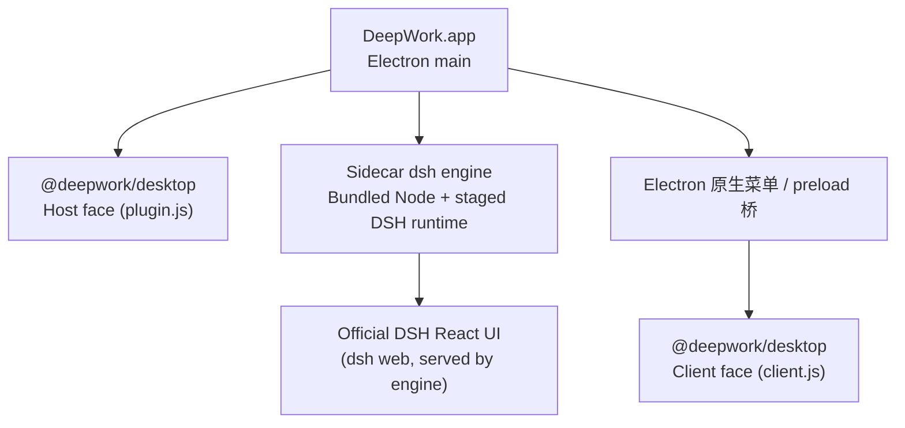

<p align="center">
  <strong>简体中文</strong> ·
  <a href="./README.en.md">English</a>
</p>

<div align="center">
  
  <h1>DeepWork</h1>
  <p><strong>以 DeepSeek Harness 为后端引擎的桌面壳（Electron + sidecar dsh + 官方 DSH Web UI）。</strong></p>
  <p>
    <a href="#架构">架构</a> ·
    <a href="#桌面原生能力">桌面原生能力</a> ·
    <a href="#平台与产物">平台与产物</a> ·
    <a href="#构建与发布">构建与发布</a>
  </p>
</div>

<p align="center">
  
  
  
  
  
  
</p>

DeepWork 是一个围绕 [DeepSeek Harness](https://github.com/deepseek-ai/deepseek-harness)
（DSH）的桌面应用：Electron 壳担任宿主，spawn 一个**原版 `dsh` 引擎**作为 sidecar，
再把引擎 Web runtime 的官方 DSH React UI 加载进 Chromium。模型仍运行在云端，桌面端
负责窗口、菜单、引擎生命周期与本地集成交互。

它不是另一套 DSH 前端，也不额外安装 Web Terminal 或 shell plugin：界面就是
`dsh web` 官方 UI，桌面能力以插件形式注入同一个引擎。

> [!IMPORTANT]
> **社区维护的非官方第三方项目。** 本项目并非 DeepSeek 官方产品，不由 DeepSeek
> 开发、发布、背书或提供支持。`DeepSeek`、`DeepSeek Harness`、`dsh` 及相关名称、
> 标识和商标归其各自权利人所有。桌面端的问题请提交到本仓库，不要联系 DeepSeek
> 官方支持。

## 架构



- `src/main.ts`（Electron main）：建窗口、原生菜单、splash，监督 sidecar 引擎的
  完整生命周期，并桥接原生动作与渲染进程。
- `src/runtime.ts`（`SidecarSupervisor`）：用**真实 Node**（staged node-runtime）
  spawn 引擎进程：`<node> <dsh CLI> --profile web --patch <cordis.patch.yml>`，
  监听 `dsh web: http://127.0.0.1:<port>` 就绪行后把该 URL 交给 Chromium。
  退出时 SIGTERM → 超时 SIGKILL 逐级回收。
- `src/profile.ts`（`ensureProfile`）：引导共享的 `$DSH_HOME/profiles/web` ，
  保留既有 bundles / 依赖 / 用户 patch，仅以 `link:` 装入 `@deepwork/desktop`，
  并把桌面补丁层经 `--patch` 传入——**浏览器与桌面共用一个 Profile**。
- `src/plugin.ts`（Host 面，`dist/plugin.js`）：把桌面能力发布进 DSH Host 图
  （`provide('desktop', …)`），注入一段识别 DeepWork 表面的系统提示，并注册
  `DEEPWORK_*` bash 环境变量。
- `src/client.ts`（Client 面，`dist/client.js`）：极薄的命令桥——把原生菜单动作
  转发到 DSH 的 `sessions` / `workspaces` / `layout` 服务（依赖 Electron
  preload 桥 `window.dshDesktop`）。
- `src/preload.ts` / `src/contracts.ts`：contextBridge 暴露的最小桌面桥与类型契约。
- `cordis.patch.yml`：开机补丁层——webserver 锁 `127.0.0.1` 随机端口，并
  `insert` `deepwork` 插件行。

### 与 CLI / 浏览器共享 $DSH_HOME

引擎继承 shell 的 `DSH_HOME`（默认 `~/.dsh`，可用环境变量覆盖），与 CLI、浏览器
GUI 共用同一套模型配置、凭据、会话与附件；且桌面直接挂在同一 `web` profile 上，
不产生第二套状态。桌面自己的日志等状态放在 Electron userData。

### 运行时目录

| 目录 | 内容 | 是否入库 |
| --- | --- | --- |
| `stage/dsh-runtime` · `stage/node-runtime` | `stage:dsh` 产出的 DSH / Node 运行时 | 否（gitignore） |
| `.cache/` | DSH 源码 clone 与 Node 下载缓存 | 否 |
| `dist/` | `build` 的桌面 / 插件编译产物 | 否 |
| `release/` | electron-builder 打包产物 | 否 |
| `src/` | 壳与插件源码 | 是 |

## 桌面原生能力

当前版本是保留官方 DSH UI 的精简壳：

- **窗口与生命周期**：splash（启动/出错/重启态，含日志尾部）、单实例锁、
  macOS 假 keychain（`--use-mock-keychain`）、窗口关闭即退出引擎。
- **原生菜单（macOS）**：关于 / 设置… / 重新启动引擎 / 服务 / 隐藏 / 退出；
  **文件**：新建会话、打开工作区…、关闭；**编辑** / **视图** / **窗口** 为标准角色。
- **快捷键**（实际生效的）：
  | 操作 | 快捷键 |
  | --- | --- |
  | 新建会话 | `Cmd/Ctrl+N` |
  | 打开工作区… | `Cmd/Ctrl+O` |
  | 切换侧边栏 | `Cmd/Ctrl+B` |
  | 设置… | `Cmd/Ctrl+,` |
  | 重新启动引擎 | `Cmd/Ctrl+Shift+R` |
- **命令桥**：菜单动作经 preload → `client.ts` 转发到 DSH 服务（新建会话 / 打开
  工作区路径 / 打开设置 / 切换侧边栏 / 聚焦输入框）。
- **平台内核**：窗口采用 `sandbox + contextIsolation`，webview 只放行
  `http(s)` 且移除其 preload；引擎只监听 loopback 随机端口；剪贴板
  `clipboard-sanitized-write` 仅对运行时来源放行。

> 说明：本版本**不包含** PTY 终端面板、逐提交/逐行 Review、Browser / Files 面板、
> 插件市场、桌面皮肤、Pinned Summary 等早期迭代能力；这些功能在独立的 DeepWork
> Web 表面改造仓库另行推进，本仓库只维护「壳 + 官方 UI」这一形态。

## 平台与产物

本仓库对外发布四个平台的安装包（同一 Git tag 的 GitHub Release 下）：

| 平台 | 产物（当前 v0.1.2） | 构建命令 |
|------|------|----------|
| macOS arm64 | `DeepWork-0.1.2-mac-arm64.dmg` / `.zip` | `pnpm run dist:mac` |
| macOS x64 | `DeepWork-0.1.2-mac-x64.dmg` / `.zip` | `pnpm run dist:mac:x64` |
| Windows x64 | `DeepWork-0.1.2-win-x64.exe`（NSIS） | `pnpm run dist:win` |
| Windows arm64 | `DeepWork-0.1.2-win-arm64.exe`（NSIS） | `pnpm run dist:win:arm64` |

打包会把目标平台的 Node 运行时（Windows `node.exe`，macOS `bin/node`）与目标平台
原生模块一并打进包：`stage-dsh.mjs` 在目标平台与宿主不一致时向
`pnpm-workspace.yaml` 写入 `supportedArchitectures`（os/cpu 含 `current` + 目标），
让 deploy 阶段拉入目标平台的原生依赖（如 `@koromix/koffi-*`、`node-addon-require-builtin`、
`node-pty` prebuild 等），因此 macOS 上交叉打出的 Windows / x64 包也含目标平台的
原生模块。macOS 交叉打包 Windows 时，`build-win.mjs` 会把 electron-builder 缓存的
`7za` 包装为 `-snl`（符号链接按链接存储、不跟随），避免 staged 工作区递归链接导致
ENAMETOOLONG 构建失败。

## 从源码运行

前置：Node.js 24+ 与 pnpm：

```sh
pnpm install
pnpm run build       # 编译 main/preload/plugin/client → dist/
pnpm run stage:dsh   # 产出 stage/dsh-runtime 与 stage/node-runtime
pnpm start
```

- 首次 `stage:dsh` 会把固定版本 DSH（`0.1.0-rc.5`，commit
  `47f943859bef60e4160492346772ded9b24f765a`）clone 进 `.cache/dsh-source/` 并构建。
- 使用本地 DSH checkout 作为后端引擎：`DSH_SOURCE=/path/to/deepseek-harness`
  （版本必须与固定版本一致），再执行 `pnpm run build:dsh`（完整重建固定 DSH）与
  `pnpm run stage:dsh`。
- 希望改动时时热更：`pnpm run dist:mac:quick` 使用已缓存的 DSH 构建。

## 安装

从 [GitHub Releases](https://github.com/oli-bot/dsh-desktop/releases)
下载对应平台安装包（当前 v0.1.2）：

- macOS arm64 / x64：`DeepWork-0.1.2-mac-arm64.dmg`（或 `.zip`）等
- Windows x64 / arm64：`DeepWork-0.1.2-win-x64.exe` 等

macOS 打开 DMG 拖入 `Applications`；测试包没有 Developer ID 与 notarization，首次
启动可在 Finder 右键应用选择「打开」。Windows 运行 NSIS 安装器（非 one-click，可
选择安装目录）。应用与原生 DSH 共享 `$DSH_HOME`，模型配置与 API Key 在 DSH 设置页
配置即可（凭据由 DSH 持久化在共享 home 下）。

## 构建与发布

```sh
# macOS arm64：完整构建（重建固定 DSH） / quick（跳过 DSH 重建）
pnpm run dist:mac
pnpm run dist:mac:quick

# macOS x64（在 arm64 构建机上交叉构建）
pnpm run dist:mac:x64

# Windows x64 / arm64（Windows 机器、或 macOS 上交叉构建）
pnpm run dist:win
pnpm run dist:win:quick
pnpm run dist:win:arm64

# 四平台顺序构建
pnpm run dist:all
```

产物在 `release/`：`DeepWork-<version>-mac-arm64.dmg/.zip`、`mac-x64.dmg/.zip`、
`win-x64.exe`、`win-arm64.exe`，连同 `latest-mac.yml` / `latest.yml`（自动更新
元数据）与未打包目录（`mac-arm64` / `mac` / `win-unpacked` / `win-arm64-unpacked`）。

GitHub Actions（`.github/workflows/release.yml`，`v*` tag 触发）在 `macos-latest`
上跑完整构建并上传 macOS arm64 产物到该 tag 的 Release；Windows / x64 产物由
macOS 交叉构建（`pnpm run dist:win:*`、`dist:mac:x64`）或 Windows 机器产出后再上传
到同一 Release（windows-latest 原生 CI 被 junction 树 staging 问题阻塞，见 workflow
注释）。发布前建议本机验证：

```sh
pnpm run typecheck
pnpm test
pnpm run dist:mac:quick
codesign --verify --deep --strict release/mac-arm64/DeepWork.app
hdiutil verify release/DeepWork-0.1.2-mac-arm64.dmg
```

准备新版本：先统一更新 `package.json` 的 `version`，再以同一版本创建 tag 与
Release（`gh release create vNEXT <artifacts...>`），随后把产物作为 Release 附件上传。

## 安全边界

- 引擎只监听 `127.0.0.1` 随机端口；Agent 管理通道不对外。
- 窗口 `sandbox + contextIsolation`、无 `nodeIntegration`；webview 仅放行 `http(s)`
  来源并剥离 preload。
- 桌面补丁层经 `--patch` 注入引擎，不写入用户 profile 的 `cordis.patch.yml`；
  `ensureProfile` 只追加 `@deepwork/desktop` 一个 `link:` 依赖，不覆盖用户已有
  bundles、依赖与 patch。
- 引擎进程由 supervisor 监督，退出即干净回收；多实例由单实例锁防重。

## License

[MIT](./LICENSE)
